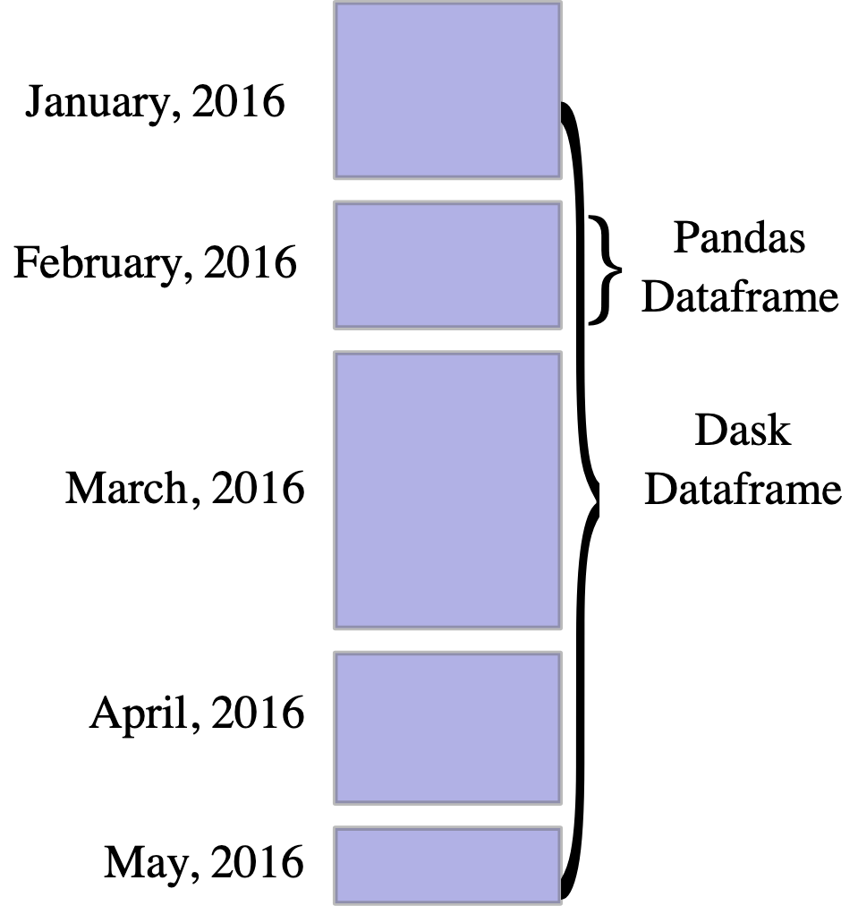

# Speed up the python data analysis

Sometimes you open a big dataset with python's pandas, try to get a few metrics, and the whole thing just freezes horribly.

If you work on Big Data, you know if you're using Pandas, you can be waiting for up to a whole minute for simple average of a Series, and let's not even get into calling **apply**. And that's just for a couple of million rows!. When you get into billions, you better start using Spark or something.

I found out this tool a short while ago: a way to speed up Data Analysis in Python, without having to get better infrastructure or switching languages. It will eventually feel limited if your Dataset is huge, but it scales a lot better than regular pandas, and may be just fit for your problem - especially if you're not doing a lot of reindexing.

## What is Dask?

Dask is an Open Source project that gives you abstractions over Numpy Arrays, Pandas dataframes and regular lists, allowing you to run operations on them in parallel, using multi-core processing.

Here's an excerpt straight from tutorial:

> Dask provides high-level array, Bag and Dataframe collections that mimic NumPy, lists and Pandas but can operate in parallel on datasets that don't fit into main memory. Dask's high level collections are are alternatives to NumPy and Pandas.

## Reading the docs

A Dask dataframe is a large parallel DataFrame composed of many smaller pandas DataFrames, split along the index. These Pandas DataFrames may live on disk for larger-than-memory computing on single machine, or on many different machines in cluster. One Dask dataframe operation triggers many operations on the constituent Pandas DataFrame.

## Design

Dask dataFrames coordinate many Pandas DataFrames / Series arranged along the index. A Dask DataFrame is petitioned row-wise, grouping rows by index value for efficiency. These pandas objects may live on disk or on other machines.




Here are couple of methods we can use with Dask Dataframe

* Arithmetic operations \( multiply or adding to a Series \)
* Common aggregations \( mean, min, max, sum etc. \)
* Calling apply \( as long as it's along the index- that is, not after a group by\('y'\) \) 
* calling value\_counts\(\), drop\_duplicates\(\) or corr\(\)
* Filtering with loc, isin and rowwise-selection

```text
df2 = df.loc[df['x'] > 5 ]

df3 = df.x.isin(range(4))

df4 = df[df['x']>5]
```

## How to use Dask DataFrames

Dask Dataframes have same API as Pandas Dataframes, except aggregations and applys are evaluated lazily, and need to be computed through calling the compute method. In order to generate a Dask Dataframe you can simply call the _read\_csv_ method just as you would in Pandas, or, given a pandas Dataframe _df,_ you can just call.

```text
dd = ddf.from_pandas(df,npartitions=N)
```

According to StackOverflow, it is advised to partition the Dataframe in about as many partition as cores your computer has, or couple of times that number, as each partition will run on a different thread and communication between them will become too costly if there are too many.

## Benchmark


